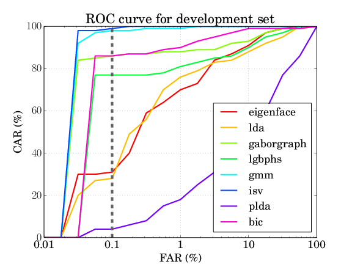
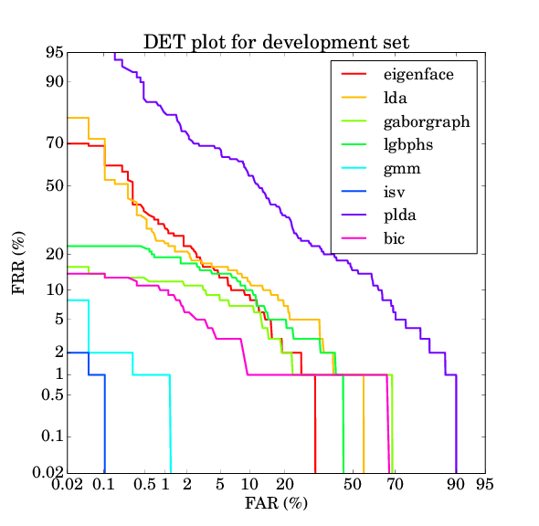
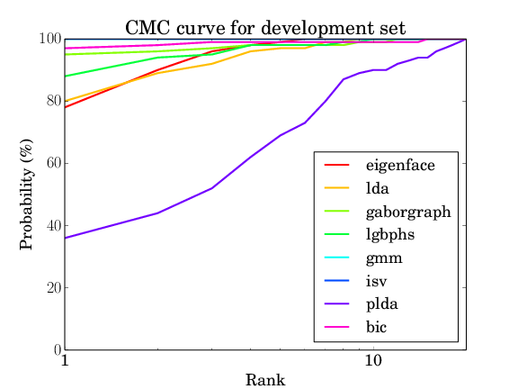

.. vim: set fileencoding=utf-8 :
.. author: Manuel Günther <manuel.guenther@idiap.ch>
.. date: Thu Sep 20 11:58:57 CEST 2012

.. _baselines:

=============================
Executing Baseline Algorithms
=============================

The first thing you might want to do is to execute one of the baseline algorithms that are implemented in the FaceRecLib.

Setting up your Database
------------------------

As already mentioned, the image databases are not included in this package, so you have to download them.
For example, you can easily download the images of the `AT&T database`_, for links to other utilizable image databases please read the :ref:`databases` section.

By default, the FaceRecLib does not know, where the images are located.
Hence, before running experiments you have to specify the image database directories by modifying the accordant configuration files.
For further information on these topic, you might want to read the :ref:`managing-resources` and the :ref:`databases` sections.
To make the baseline algorithms work, e.g., on the `AT&T database`_, you have to correct the  ``atnt_directory`` entry in the `facereclib/configurations/databases/atnt.py <../facereclib/configurations/databases/atnt.py>`_ file.

Structure of an Experiment in the FaceRecLib
--------------------------------------------

Each face recognition experiment that is run with the FaceRecLib is divided into several steps.
The steps are:

1. Data preprocessing: Raw data is preprocessed, e.g., images are aligned and photometrically enhanced.
2. Feature extractor training: Feature extraction parameters are learned.
3. Feature extraction: Features are extracted from the preprocessed data.
4. Feature projector training: Parameters of a subspace-projection of the features are learned.
5. Feature projection: The extracted features are projected into a subspace.
6. Model enroller training: The ways how to enroll models from extracted or projected features is learned.
7. Model enrollment: One model is enrolled from the features of one or more images.
8. Scoring: The verification scores between various models and probe features are computed.
9. Evaluation: The computed scores are evaluated and curves are plotted.

The communication between two steps is file-based, usually using a binary HDF5_ interface, which is implemented in the :py:class:`bob.io.base.HDF5File` class.
The output of one step usually serves as the input of the subsequent step(s).
Depending on the algorithm, some of the steps are not applicable/available.
E.g. most of the feature extractors do not need a special training step, or some algorithms do not require a subspace projection.
In these cases, the according steps are skipped.
The FaceRecLib takes care that always the correct files are forwarded to the subsequent steps.

Running Baseline Experiments
----------------------------

To run the baseline experiments, you can use the ``./bin/baselines.py`` script by just going to the console and typing:

.. code-block:: sh

  $ ./bin/baselines.py

This script is a simple wrapper for the ``./bin/faceverify.py`` script that will be explained in more detail in the :doc:`experiments` section.
The ``./bin/baselines.py --help`` option shows you, which other options you have.
Here is an almost complete extract:

* ``--database``: The database and protocol you want to use.
  By default this is set to the image database *atnt*.
* ``--algorithms``: The recognition algorithms that you want to execute.
  By default, only the *eigenface* algorithm is executed.
* ``--all``: Execute all algorithms that are implemented.
* ``--directory``: The directory where the files of the experiments are put to.
  If not specified, by default the files are split up into the temporary files and the result files, see the ``--temp-directory`` and the ``--result-directory`` of ``./bin/faceverify.py --help``.
  In this script, if the ``--directory`` option is specified, all files will be put into the given directory.
* ``--evaluate``: After running the experiments, the resulting score files will be evaluated, and the result is written to console.
* ``--dry-run``: Instead of executing the algorithm (or the evaluation), only print the command that would have been executed.
* ``--verbose``: Increase the verbosity level of the script.
  By default, only the commands that are executed are printed, and the rest of the calculation runs quietly.
  You can increase the verbosity by adding the ``--verbose`` parameter repeatedly (up to three times).

Usually it is a good idea to have at least verbose level 2 (i.e., calling ``./bin/baselines.py --verbose --verbose``, or the short version ``./bin/baselines.py -vv``).

The Algorithms
--------------

The algorithms present an (incomplete) set of state-of-the-art face recognition algorithms. Here is the list of short-cuts:

* ``eigenface``: The eigenface algorithm as proposed by [TP91]_. It uses the pixels as raw data, and applies a *Principal Component Analysis* (PCA) on it.

* ``lda``: The LDA algorithm applies a *Linear Discriminant Analysis* (LDA), here we use the combined PCA+LDA approach [ZKC+98]_ .

* ``gaborgraph``: This method extract grid graphs of Gabor jets from the images, and computes a Gabor phase based similarity [GHW12]_.

* ``lgbphs``: *Local Gabor Binary Pattern Histogram Sequences* (LGBPHS) [ZSG+05]_ are extracted from the images and compares using the histogram intersection measure.

* ``gmm``: *Gaussian Mixture Models* (GMM) [MM09]_ are extracted from *Discrete Cosine Transform* (DCT) block features.

* ``isv``: As an extension of the GMM algorithm, *Inter-Session Variability* (ISV) modeling [WMM+11]_ is used to learn what variations in images are introduced by identity changes and which not.

* ``plda``: *Probabilistic LDA* (PLDA) [Pri07]_ is a probabilistic generative version of the LDA, in its scalable formulation of [ESM+13]_.
  Here, we also apply it on pixel-based representations of the image, though also other features should be possible.

* ``bic``: In the *Bayesian Intrapersonal/Extrapersonal Classifier* (BIC) [MWP98]_, a gabor-grid-graph based similarity vector is classified to be intrapersonal (i.e., both images are from the same person) or extrapersonal, as explained in [GW09]_.

* ``lrpca``: In Local Region PCA [PBD+11]_, the face is sub-divided into local regions and a PCA is performed for each local region.

* ``lda_ir``: The LDA-IR (a.k.a. CohortLDA [LBP+12]_) extracts color information from images after, and computes a PCA+LDA projection on two color layers.

.. note::
  The ``plda`` algorithm is currently under construction and the setup is not yet useful.

.. note::
  The ``lrpca`` and ``lda_ir`` algorithms are taken from the `CSU Face Recognition Resources`_ and are only available when ``xfacereclib.extension.CSU`` and ``PythonFaceEvaluation`` is enabled (e.g. by using the `buildout-with-csu.cfg <file:../buildout-with-csu.cfg>`_ during the buildout step), see :ref:`installation` for details.

.. _baseline_results:

Baseline Results
----------------

To evaluate the results, a wrapper call to ``bin/evaluate.py`` is produced by the ``bin/baselines.py --evaluate`` command.
Several types of evaluation can be achieved, see :ref:`evaluate` for details.
Particularly, here we can enable ROC curves, DET plots, CMC curves and the computation of EER/HTER.
Hence, the complete set of results of the baseline experiments are generated using:

.. code-block:: sh

  $ ./bin/baselines.py --all -vv --evaluate ROC DET CMC HTER

If you specified other parameters for the execution of the algorithms, e.g., the ``--directory`` flag, you have to add these options here as well.
If you ran only a sub-set of the available, the missing algorithms will just be skipped.
The resulting files will be **ROC.pdf**, **DET.pdf** and **CMC.pdf**, and the HTER results are simply written to console.

For the `AT&T database`_ the results should be as follows:

.. table:: The HTER results of the baseline algorithms on the AT&T database

  +-------------+-------------+-------------+-------------+-------------+-------------+-------------+-------------+
  |  eigenface  |     lda     |  gaborgraph |    lgbphs   |     gmm     |     isv     |    plda     |     bic     |
  +=============+=============+=============+=============+=============+=============+=============+=============+
  |   8.237%    |   10.000%   |   6.211%    |     8.500%  |    0.658%   |    0.053%   |   25.342%   |    3.526%   |
  +-------------+-------------+-------------+-------------+-------------+-------------+-------------+-------------+

.. note::
  The ``lrpca`` and ``lda_ir`` algorithms require hand-labeled eye positions to run.
  Since the AT&T database does not provide eye positions, it is not possible to provide baseline results on AT&T for these two algorithms.

.. include:: links.rst
